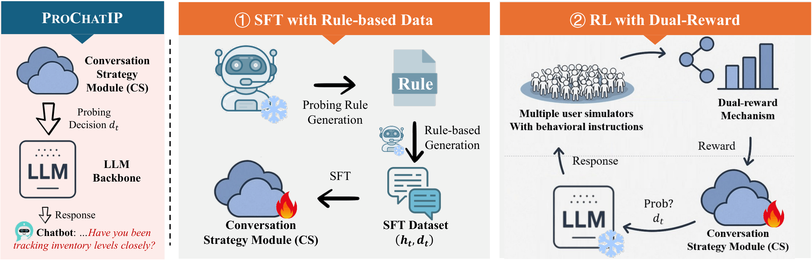

# 🚀 Towards Proactive Information Probing: Customer Service Chatbots Harvesting Value from Conversation

**ACL 2026 Findings**

This repository contains the official implementation of the ACL 2026 Findings paper:
“Towards Proactive Information Probing: Customer Service Chatbots Harvesting Value from Conversation”.

📄 **Paper link:** (to be added)

---

## ✨ Overview

<p align="center">
  
  <br>
  <i><b>Figure 1:</b> Overview of PROCHATIP. It incorporates a conversation strategy module (CS) that explicitly guides the timing of information probe $d_t$. Here, the CS module is trained via two-stage curriculum.</i>
</p>

This project builds a two-stage training pipeline for proactive information probing in customer service dialogue.

1. Supervised Fine-Tuning (SFT): train a binary Ask/Answer classification model using labeled dialogue examples.
2. Reinforcement Learning: fine-tune the policy to decide when to probe users with follow-up questions versus when to answer directly.

The repository includes prompt templates, data preparation utilities, baseline evaluation scripts, and rewards-based dialogue training.

---

## ⚡ Quick Start

Recommended installation using `uv` if available:

```bash
python -m pip install --upgrade pip
python -m pip install uv
uv sync
```

If you prefer pip directly, install the dependencies from `pyproject.toml`:

```bash
python -m pip install typer torch==2.4.1 transformers==4.51.0 tokenizers==0.21.0 trl>=0.19.1 datasets>=4.4.1 faiss-cpu>=1.13.1 openai>=2.14.0 httpx[http2]>=0.28.1 scikit-learn>=1.7.2 krippendorff>=0.8.2 matplotlib>=3.10.8
```

Prepare the dataset folder under `data/` and configure `OPENAI_API_KEY` if using the model API backend.

---

## 🧠 Pipeline (Minimal)

### 1. Train SFT model first

```bash
python sft_train.py train \
  --model-path ../model/Qwen3-0.6B \
  --output-dir model/sft_output \
  --data-file data/sft_data.json \
```

### 2. Run reinforcement learning with the SFT model

```bash
python main.py train \
  --sft-model-path model/sft_output \
  --dataset finqa \
  --output-dir model/rl_output \
  --episodes 500
```

### 3. Evaluate baselines

```bash
python baseline.py eval \
  --dataset finqa \
  --algorithm proactive \
  --max-turns 8
```

---

## 🎯 Evaluation

The repository measures proactive probing performance with the following metrics:

- TSR / Success Rate: whether the target information was obtained successfully.
- AvgT / Average Turns: number of dialogue turns used.
- RPR / Reject Rate: how often the simulated user refused to answer.
- QRR / Query Reply Rate: how often the user replied to questions.
- PC / Probing Coherence: quality of the assistant's probing strategy.

`baseline.py` prints metrics for each difficulty level (`low`, `medium`, `high`) and overall performance.

---

## 📁 Structure

- `main.py` — reinforcement learning training and validation pipeline.
- `baseline.py` — baseline evaluation for standard, proactive, and ICL-AIF strategies.
- `sft_train.py` — supervised fine-tuning training for Ask/Answer classification.
- `generate_user_rule.py` — rule generation for simulated user refusal behavior.
- `prompt.py` — prompt builders for system, user, critic, and proactive strategies.
- `utils.py` — utilities for seeding, OpenAI model calls, and conversation formatting.
- `pyproject.toml` — dependency and packaging configuration.
- `data/` — dataset files, rules, and split data.

---

## Data Notes

Typical data entries include:

- `user_question`: initial user prompt.
- `assistant_question`: target follow-up question for probing.
- `assistant_context`: assistant background or task description.
- `user_context`: simulated user background.
- `relation`: difficulty or relation label such as `low`, `medium`, `high`.
